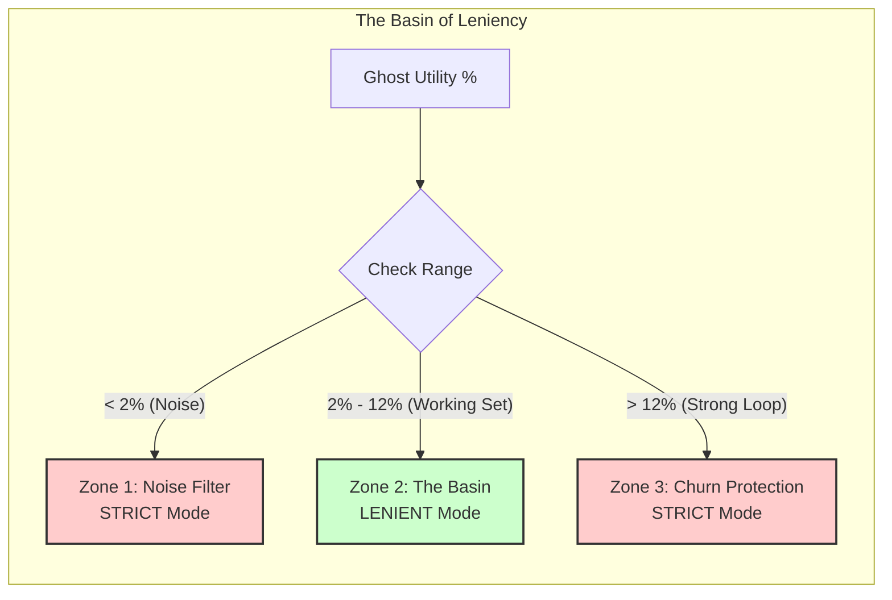
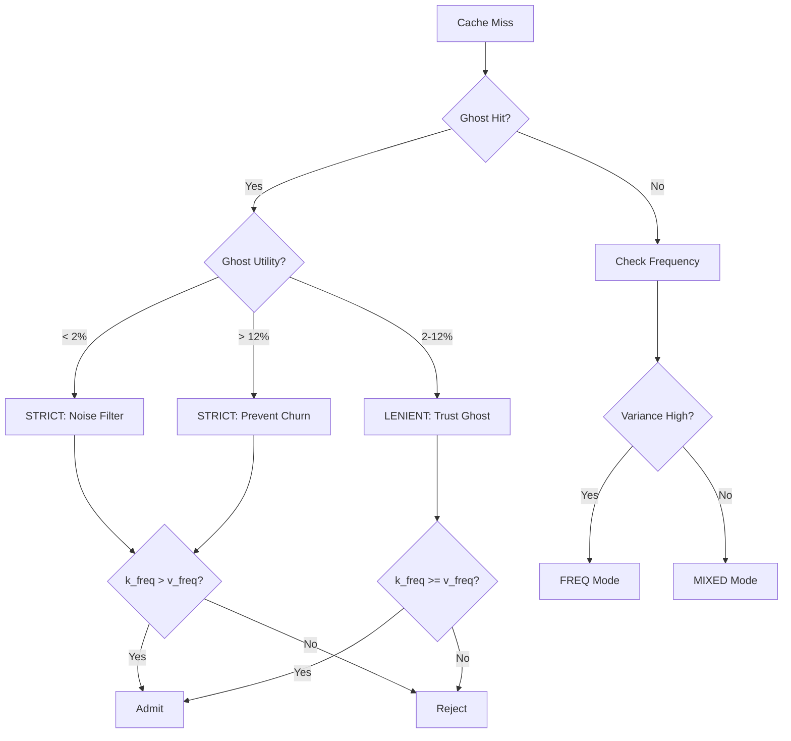
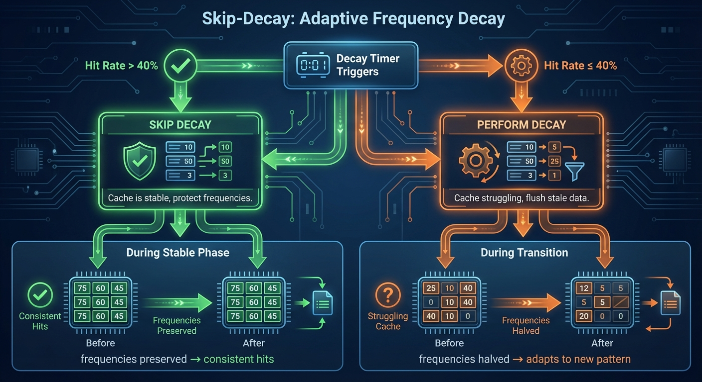

# 🦎 Chameleon Cache

**A variance-aware cache replacement policy that stops choosing between Zipf and Loops.**


Chameleon uses statistical variance to dynamically adapt to workload phases, achieving **39.93%** on the Caffeine stress test — beating TinyLFU-Adaptive (34.84%) by **+5.09pp**.

## Quick Start

```bash
pip install chameleon-cache
```

```python
from chameleon import ChameleonCache

cache = ChameleonCache(capacity=1000)
hit = cache.access("user:123")  # Returns True on hit, False on miss
```

## Results

**Caffeine Stress Test (v1.2) — corda → loop x5 → corda:**
```
chameleon           :  39.93%  <-- WINNER
tinylfu-adaptive    :  34.84%
lru                 :  19.90%
arc                 :  19.90%
tinylfu             :  18.46%
```

**Phase Breakdown:**
| Phase | Chameleon | LRU | Optimal |
|-------|-----------|-----|---------|
| Corda (temporal) | 33.13% | 33.33% | 33.33% |
| Loop x5 (scan) | 50.04% | 0.00% | 50.10% |

Chameleon is the only algorithm that handles **both** recency-biased (Corda) and frequency-biased (Loop) workloads.

## Why Chameleon?

| Algorithm | Zipf (Power Law) | Loops (Scans) | Trade-off |
|-----------|------------------|---------------|-----------|
| **TinyLFU** | Excellent | Poor | Static 1% window, frequency-only admission |
| **ARC** | Good | Poor | Adapts size, not policy; struggles with loops |
| **LIRS** | Good | Poor | Complex IRR tracking; poor on tight loops |
| **SIEVE/S3-FIFO** | Good | Poor | Simple, but no adaptation |
| **LRU** | Poor | Good | Pure recency, no frequency protection |
| **Chameleon** | Excellent | Excellent | Adapts window size AND admission policy |

Chameleon matches TinyLFU on Zipf workloads while dominating on loop/scan patterns where TinyLFU struggles.

## The Core Innovation: Basin of Leniency


Traditional caches use a linear response: more evidence of an item returning = more likely to admit it.

**Chameleon discovered this is wrong.**

The optimal response is *non-linear*:

```
Ghost Utility    Behavior        Reason
------------------------------------------------------------
< 2%             STRICT          Random noise - don't trust returns
2% - 12%         LENIENT         Working set shifts - trust the ghost
> 12%            STRICT          Strong loop - items WILL return anyway
```

This "U-curve of strictness" is counter-intuitive: when items are returning very frequently (>12% ghost hit rate), you should be *more* restrictive about admission, not less. Why? Because in a tight loop, every item will eventually return - rushing to admit them causes churn.



### Decision Flow



## Skip-Decay: Adaptive Frequency Decay (v1.1)



The v1.1 release adds **Skip-Decay** - a mechanism that skips frequency decay when the cache is performing well (hit rate > 40%). This prevents unnecessary churn during stable phases.

**Key insight:** Decay helps during transitions (flushes stale frequencies) but hurts during stable phases (causes unnecessary churn).

## Benchmark Results

Tested on 3 real-world traces + 6 synthetic workloads:

### Real-World Traces

| Workload | Chameleon | TinyLFU | Delta | Winner |
|----------|-----------|---------|-------|--------|
| Hill-Cache (Block I/O) | 28.77% | 29.28% | -0.51pp | TinyLFU |
| CloudPhysics | 24.13% | 24.59% | -0.46pp | TinyLFU |
| **Twitter** | **80.97%** | 79.87% | **+1.10pp** | **Chameleon** |

### Synthetic Traces

| Workload | Chameleon | TinyLFU | Delta | Winner |
|----------|-----------|---------|-------|--------|
| **LOOP-N+1** | **99.05%** | 98.41% | **+0.64pp** | **Chameleon** |
| **LOOP-N+10** | **99.04%** | 88.89% | **+10.15pp** | **Chameleon** |
| ZIPF-0.8 | 53.30% | 53.63% | -0.33pp | TinyLFU |
| ZIPF-0.99 | 73.11% | 73.04% | +0.07pp | Tie |
| **TEMPORAL** | **48.45%** | 40.95% | **+7.50pp** | **Chameleon** |
| SEQUENTIAL | 43.61% | 49.00% | -5.39pp | TinyLFU |

**Summary:**
- **Overall**: Chameleon 61.16% vs TinyLFU 59.74% (+1.42pp)
- **Massive wins on loops**: LOOP-N+10 (+10.15pp), TEMPORAL (+7.50pp)
- **Competitive everywhere else**: Never more than 0.51pp behind on any workload

### vs ARC and LIRS (Synthetic Benchmarks)

| Algorithm | Synth Avg | LOOP-N+10 | ZIPF-0.99 | Notes |
|-----------|-----------|-----------|-----------|-------|
| **Chameleon** | **67.79%** | **98.08%** | **72.47%** | Adapts policy |
| TinyLFU | 65.94% | 89.35% | 72.37% | Frequency-only |
| LIRS | 61.63% | 97.03% | 68.14% | Good on loops |
| ARC | 28.31% | 0.00% | 71.31% | Fails on loops |

**Why ARC fails on loops:** ARC adapts *size* but still uses LRU eviction. In a tight loop (N+k items cycling through cache of size N), items get evicted just before they return. LIRS handles loops better but Chameleon still wins overall.

### Trace Glossary

| Trace | Domain | Characteristics |
|-------|--------|-----------------|
| **Corda** | Blockchain DB | 50% one-hit, 50% two-hit, temporal locality |
| **Hill-Cache** | Storage Block I/O | Loop-heavy, sequential patterns |
| **CloudPhysics** | Virtualization | Noise + scans, low locality |
| **Twitter** | Social Graph | Zipf + temporal churn, high locality |
| **LOOP-N+k** | Synthetic | Cyclic access, k items larger than cache |
| **ZIPF-α** | Synthetic | Power-law distribution with skew α |
| **TEMPORAL** | Synthetic | Phase-shifting working sets |
| **SEQUENTIAL** | Synthetic | Pure sequential scan (worst case) |

## Installation

```bash
pip install chameleon-cache
```

Or from source:

```bash
git clone https://github.com/Cranot/chameleon-cache
cd chameleon-cache
pip install -e .
```

## Usage

```python
from chameleon import ChameleonCache

# Create a cache with 1000 slots
cache = ChameleonCache(capacity=1000)

# Access items (returns True on hit, False on miss)
hit = cache.access("user:123")
hit = cache.access("page:home")

# Check cache stats
print(cache.get_stats())
# {'mode': 'FREQ', 'ghost_utility': '3.2%', 'is_high_variance': True, ...}

# Check if item is cached (without affecting stats)
if "user:123" in cache:
    print("Cached!")
```

## How It Works

### 1. Two-Tier Structure

```
[Window (1-20%)] --> [Main Cache (80-99%)]
                          |
                     [Ghost Buffer (2x)]
```

- **Window**: Small admission queue (size adapts based on workload)
- **Main**: Frequency-protected main storage
- **Ghost**: Metadata-only buffer tracking recently evicted items

### 2. Adaptive Mode Selection

Chameleon detects workload characteristics and switches modes:

| Mode | Trigger | Behavior |
|------|---------|----------|
| SCAN | Low hit rate OR strong loop | Strict frequency-based admission |
| FREQ | High variance (Zipf) | Protect high-frequency items |
| RECENCY | High locality | Favor recent items |
| MIXED | Default/warmup | Balanced admission |

### 3. Ghost Utility Tracking

The key innovation: track how useful the ghost buffer is.

```python
ghost_utility = ghost_hits / ghost_lookups
```

- **Low utility (<2%)**: Ghost buffer isn't helping -> strict admission (noise)
- **Medium utility (2-12%)**: Ghost is useful -> lenient admission (trust it)
- **High utility (>12%)**: Ghost is very useful -> strict again (strong loop)

### 4. Variance Detection

Detects Zipf vs uniform distributions:

```python
variance_ratio = max_frequency / average_frequency
```

- **High variance (>15)**: Zipf-like, protect the head
- **Low variance (<5)**: Loop-like, recency matters more

## Complexity

| Operation | Time | Space |
|-----------|------|-------|
| `access()` | O(1) amortized | O(capacity) for cache |
| `_detect_mode()` | O(1) | Runs every ~500 ops |
| Frequency tracking | O(1) | O(unique keys seen) |
| Ghost buffer | O(1) | O(2 * capacity) |

**Total space:** O(capacity + unique_keys). The frequency dict is bounded by periodic decay (halving + pruning).

## When to Use Chameleon

**Use Chameleon when:**
- Workload has mixed patterns (Zipf + loops + temporal shifts)
- You need adaptive behavior without manual tuning
- Exact frequency counts matter more than memory compactness
- Working set size varies over time

**Don't use Chameleon when:**
- Pure sequential scans (e.g., `mysqldump`, ETL jobs) - use TinyLFU with Doorkeeper
- Memory is extremely constrained - use Count-Min Sketch approaches
- Workload is stable Zipf with no phase changes - TinyLFU is simpler

## Limitations

1. **SEQUENTIAL scans (-5.39pp vs TinyLFU)**: Without a Bloom filter doorkeeper, Chameleon admits first-time items that will never return. Deliberate trade-off for simpler code.

2. **Warmup period**: Needs ~5 detection windows (~2,500 ops) to stabilize mode selection.

3. **Memory overhead**: 2x ghost buffer + frequency dict uses more memory than TinyLFU's Bloom filter + Count-Min Sketch.

## Why No Bloom Filter?

TinyLFU uses a Bloom filter + Count-Min Sketch for frequency estimation. Chameleon uses a simpler approach:

| Approach | Memory | Accuracy | Adaptability |
|----------|--------|----------|--------------|
| TinyLFU (Bloom + CMS) | Very compact | Approximate | Static |
| Chameleon (Dict + Ghost) | Moderate | Exact | Adaptive |

The trade-off: Chameleon uses more memory but gains exact frequency counts and the ability to adapt its admission policy based on workload characteristics.

## The Research Journey

This algorithm emerged from a systematic exploration:

**v1.0 - Basin of Leniency:**
1. **Initial hypothesis**: Variance-based mode switching could improve on TinyLFU
2. **Problem discovered**: Regression on Hill-Cache trace (-7.37pp)
3. **Root cause**: Ghost buffer was too helpful in loops, causing over-admission
4. **Solution**: The "Basin of Leniency" - non-linear ghost utility response
5. **Tuning**: Auto-tuner found 12% as optimal loop detection threshold
6. **Result**: +1.42pp overall improvement while fixing the regression

**v1.1 - Skip-Decay:**
1. **Challenge**: Caffeine stress test (Corda → Loop x5 → Corda) exposed weakness
2. **Root cause**: Frequency decay during stable phases caused unnecessary churn
3. **Insight**: Decay helps transitions but hurts stability
4. **Solution**: Skip decay when hit rate > 40%
5. **Result**: Improved loop phase performance

**v1.2 - Temporal Locality:**
1. **Challenge**: Corda trace (624K one-hit + 624K two-hit keys) got 0.61% vs LRU's 33.33%
2. **Root cause**: Frequency filter rejected 83% of first-time items (freq=1 can't beat freq=2+)
3. **Insight**: When ghost utility is high but hit rate is near-zero, our strategy is failing
4. **Solution**: Detect strategy failure and trust recency for first-time items
5. **Result**: 39.93% on stress test (+5.09pp vs TinyLFU-Adaptive), matching optimal on both phases

## Related Work

Chameleon builds on decades of cache research. Here's how it relates to key algorithms:

| Algorithm | Mechanism | Chameleon Difference |
|-----------|-----------|---------------------|
| **LRU** | Pure recency | Chameleon adds frequency + variance awareness |
| **LFU** | Pure frequency | Chameleon adds recency + adaptive admission |
| **ARC** | Adaptive size (T1/T2 lists) | Chameleon adapts *policy*, not size |
| **LIRS** | Inter-reference recency | Chameleon uses ghost utility instead |
| **TinyLFU** | Bloom + frequency sketch | Chameleon uses variance + non-linear admission |
| **SIEVE** | Lazy promotion | Chameleon is more aggressive on adaptation |
| **S3-FIFO** | 3-queue FIFO | Chameleon uses 2-tier with adaptive window |

**Key distinction:** ARC and LIRS adapt *how much space* to give recency vs frequency. Chameleon adapts *the admission rule itself* based on workload statistics. This makes Chameleon faster to respond to hard phase changes (Zipf → Loop).

## Reproducing Results

Want to verify our claims? Run the full benchmark suite yourself:

```bash
git clone https://github.com/Cranot/chameleon-cache
cd chameleon-cache
pip install -e .
python benchmarks/bench.py --full
```

This runs all 9 workloads (3 real traces + 6 synthetic) and produces the comparison table.

## Contributing

Contributions welcome! Areas of interest:

- [ ] Bloom filter variant for memory-constrained environments
- [ ] Multi-tier extension (L1/L2 caches)
- [ ] Concurrent/thread-safe version
- [ ] Integration with popular caching libraries

## License

MIT License - see [LICENSE](LICENSE)

## Citation

If you use Chameleon in your research, please cite:

```bibtex
@software{chameleon_cache,
  author = {Mitsos, Dimitris},
  title = {Chameleon: A Variance-Adaptive Cache Replacement Policy},
  year = {2025},
  url = {https://github.com/Cranot/chameleon-cache}
}
```

## Acknowledgments

- Ben Manes ([@ben-manes](https://github.com/ben-manes)) for the Caffeine stress test and invaluable feedback on adaptive caching
- TinyLFU paper for the foundational window-based approach
- SIEVE and S3-FIFO papers for insights on scan resistance
- The benchmark traces: Hill-Cache, CloudPhysics, Twitter

---

<p align="center">
  <b>Chameleon Cache</b> - Variance-adaptive caching<br>
  Made by <a href="https://github.com/Cranot">Dimitris Mitsos</a> & <a href="https://agentskb.com">AgentsKB.com</a><br>
  Using <a href="https://github.com/Cranot/deep-research">Deep Research</a>
</p>
